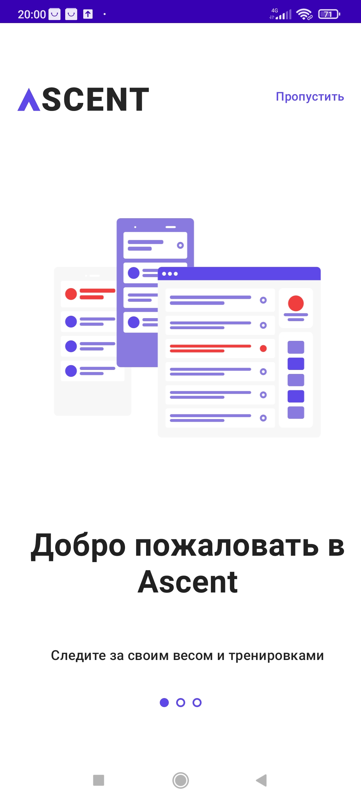
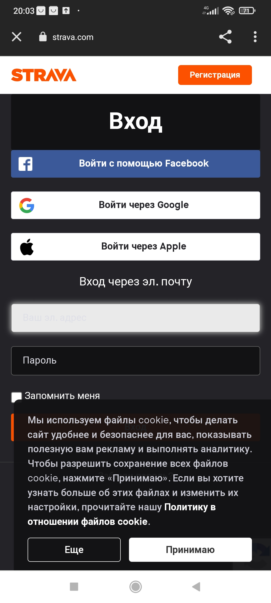
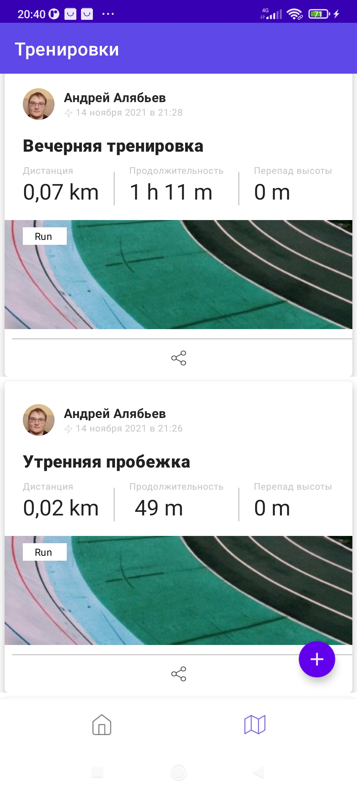
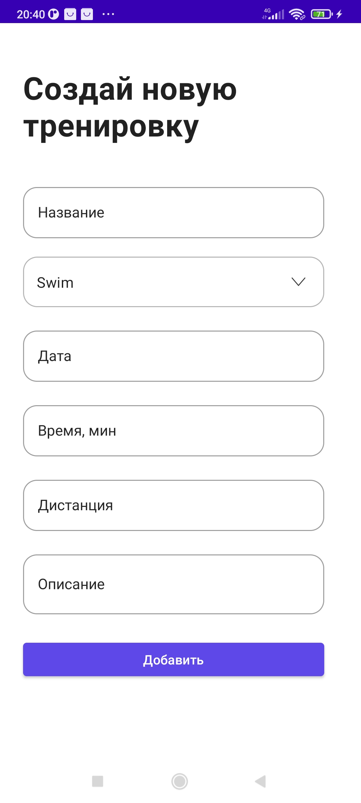

# Ascent
## Дипломный проект по курсу "Андроид-разработчик уровень 1"

Ascent - это Android - клиент сервиса для бегунов и велосипедистов Strava. Приложение выполнено по прототипу https://www.figma.com/file/J025Wx1nLc8NyjKzLwXRWk/Strava-or-Ascent-(Copy)?node-id=0%3A1. Поддерживает темную тему и два языка (русский и английский).

## Приложение позволяет:
- Авторизоваться
- Посмотреть список своих активностей.
- Создать новую активность.
- Получать оповещения о необходимости тренировок.
- Посмотреть профиль.
- Изменить свой вес.
- Выйти из профиля.
- Поделиться своим профилем с контактом из моей записной книги.
- Открыть ссылку на профиль в приложении.

## Используемые технологии и библиотеки:
- Kotlin
- Navigation
- ViewModel
- Glide
- Retrofit
- Moshi
- Coroutines
- Room
- Dagger Hilt

     
